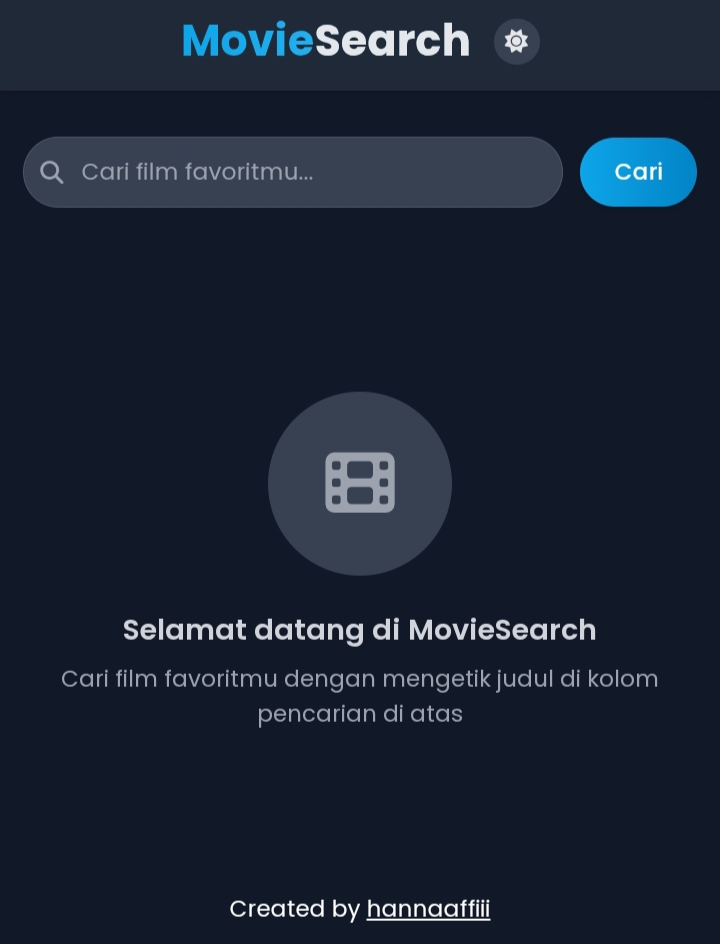

# 🎬 SeMovie — Search Movie/Film

<p align="center">
  
</p>

<p align="center">
  🔍 Aplikasi pencarian film menggunakan API gratis dari <a href="https://www.themoviedb.org/">TMDB</a>  
  Dibuat dengan <b>HTML</b>, <b>CSS</b>, <b>JavaScript</b>, dan <b>Tailwind CSS</b>.
</p>

<p align="center">
  <a href="https://github.com/frhndevweb/semovie/blob/main/LICENSE">
    
  </a>
  <a href="https://semovie.netlify.app">
    
  </a>
  <a href="https://github.com/frhndevweb/semovie">
    
  </a>
</p>

---

## 🚀 Live Demo
🔗 **[https://semovie.netlify.app](https://semovie.netlify.app)**

---

## ✨ Fitur
- 🔎 Cari film berdasarkan judul
- 🖼️ Menampilkan poster film
- ⭐ Menampilkan rating dan deskripsi singkat
- 📱 Responsive design menggunakan Tailwind CSS
- 🔑 Menggunakan API gratis dari TMDB

---

## 📂 Struktur Folder
```

index.html
src/
├── css/
│   └── style.css
└── js/
├── script.js
└── tailwind.js

````

---

## 🛠️ Teknologi
- **HTML** — Struktur halaman
- **CSS** — Styling dasar
- **JavaScript** — Logika aplikasi
- **Tailwind CSS** — Utility-first CSS framework
- **TMDB API** — Data film

---

## 📜 Cara Menjalankan
1. Clone repository:
   ```
   git clone https://github.com/frhndevweb/semovie.git
````

2. Masuk ke folder proyek:

   ```
   cd semovie
   ```
3. Buka `index.html` di browser.
4. Atur API Key TMDB di file `src/js/script.js`:

   ```
   const API_KEY = "6e230618e2508a2c144e4750c97a8809"; // free apikey, tinggal pake aja (kalo mau)
   ```

---

## 🖼️ Preview



---

## 📜 Lisensi

Proyek ini dilisensikan di bawah **MIT License**.
Lihat [LICENSE](LICENSE) untuk detail.

---


<p align="center">Made with ❤️ by <a href="https://hannaaffii.netlify.app">hannaaffiii</a></p>
